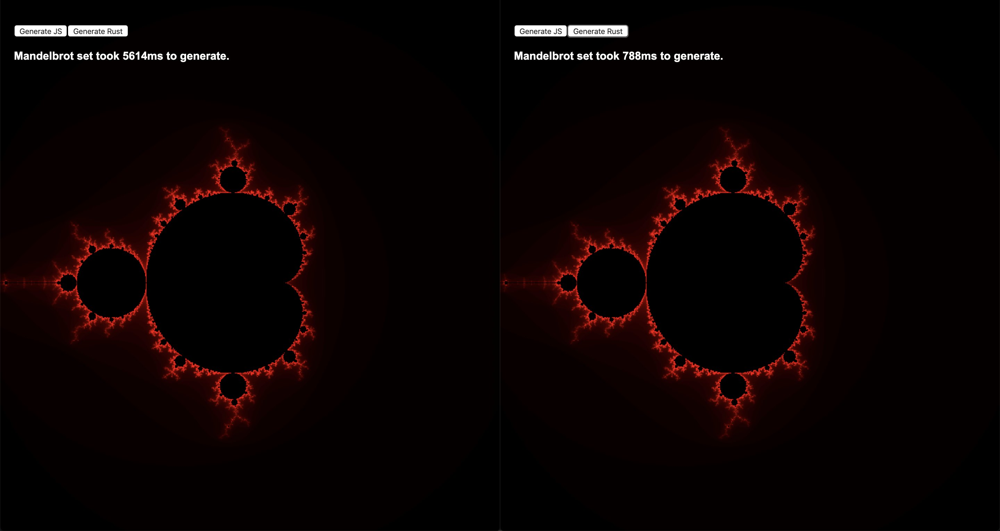

# Rustlebrot

An experiment to generate a mandelbrot set in Rust and JavaScript using webassembly!

Prerequisites:

- [rust](https://www.rust-lang.org/)
- [wasm-pack](https://github.com/rustwasm/wasm-pack)
- [yarn](https://github.com/yarnpkg/yarn)

To run:

```bash
./run.sh
```



- [x] Generate basic linear mandelbrot set in JS
- [x] Wasm bridge
- [x] Generate basic linear mandelbrot set in Rust
- [ ] Multithreading and concurrency in Rust
- [ ] Multithreading and concurrency in JS


